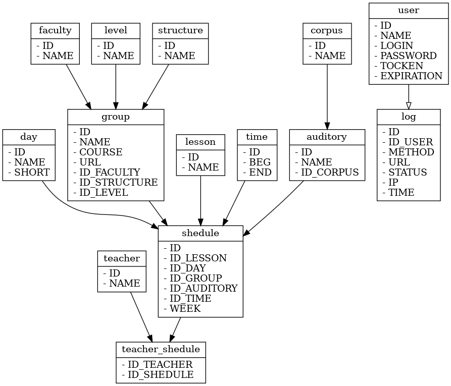
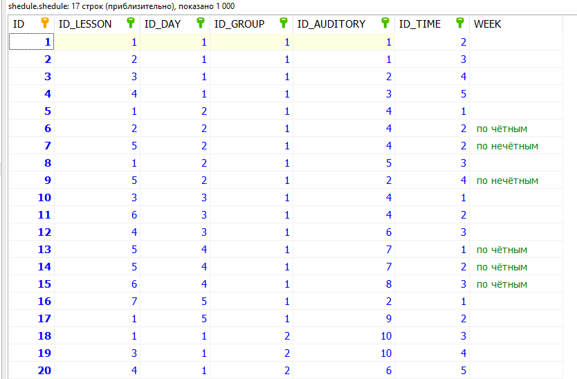
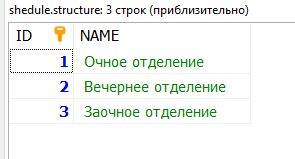
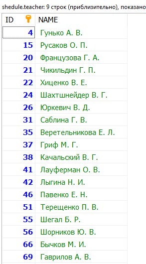
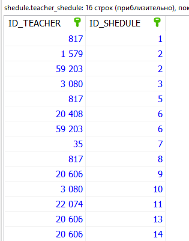
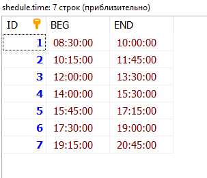
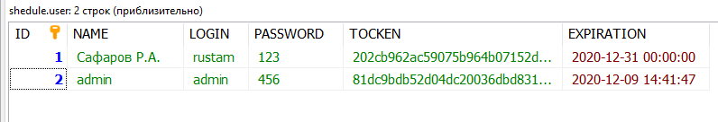

# Задача
Разработать REST API для получения расписания занятий и веб-интерфейс для его просмотра. 

# Развертывание
Веб-интерфейс и api должны быть развернуты на виртуальном сервере в облачной платформе НГТУ и доступны по внутреннему адресу (т.е. открывать наружу 80й порт не обязательно).

Пример ссылки на сайт: http://172.17.2.165

Пример ссылки на api: http://172.17.2.165:8080/v1

# Web - интерфейс
Интерфейс представлен страницей регистрации, авторазации, просмотра списка факультетов, преподавателей и корпусов. 

За интерфейс будет немного баллов, так что, если сомневаетесь что успеете - лучше его не делать. 

# Документация по API
[ссылка](https://app.swaggerhub.com/apis-docs/NSTU/shedule/1.0.0)

# Структура базы данных
Структура базы данных жестко фиксирована и описана на данной странице. Файл с sqlite базой находится в данном репозитории. Вам нужно его скачать и работать с ним.

## auditory 
Кабинеты. В таблице хранится только номер кабинета. Например - **101**. Номер представлен в текстовом виде, т.к. не всегда это число. Номер корпуса указан в отдельной таблице. Поле **NAME** может быть пустой строкой, т.к. не у всех дисциплин указана аудитория.

|Название|Тип|Длина|Беззнаковое|По умолчанию|Описание|
|--------|---|-----|-----------|------------|--------|
|**ID**|INT|10|Да|AUTO_INCREMENT|уникальный идентификатор|
|**NAME**|VARCHAR|200|-|-|название кабинета|
|**ID_CORPUS**|INT|10|Да|-|идентификатор корпуса (внешний ключ на таблицу corpus)|

  
Индексы

  
>**ID** - PRIMARY KEY

>**ID_CORPUS** - FOREIGN KEY

  
Пример

  

## corpus 
Учебные корпуса. Номер представлен в текстовом виде, т.к. не всегда это число. Поле **NAME** может быть пустой строкой, т.к. не у всех дисциплин указан корпус.

|Название|Тип|Длина|Беззнаковое|По умолчанию|Описание|
|--------|---|-----|-----------|------------|--------|
|**ID**|INT|10|Да|AUTO_INCREMENT|уникальный идентификатор|
|**NAME**|VARCHAR|200|-|-|номер корпуса|

  
Индексы

  
>**ID** - PRIMARY KEY

  
Пример

  

## day 
Названия дней недели. 

|Название|Тип|Длина|Беззнаковое|По умолчанию|Описание|
|--------|---|-----|-----------|------------|--------|
|**ID**|INT|10|Да|-|уникальный идентификатор|
|**NAME**|VARCHAR|50|-|-|название дня недели|
|**SHORT**|VARCHAR|50|-|-|сокращенное название|

  
Индексы

  
>**ID** - PRIMARY KEY

  
Пример

  

## faculty 
Названия факультетов. 

|Название|Тип|Длина|Беззнаковое|По умолчанию|Описание|
|--------|---|-----|-----------|------------|--------|
|**ID**|INT|10|Да|-|уникальный идентификатор|
|**NAME**|VARCHAR|200|-|-|название факультета|

  
Индексы

  
>**ID** - PRIMARY KEY

  
Пример

  

## group 
Данные о группах. 

|Название|Тип|Длина|Беззнаковое|По умолчанию|Описание|
|--------|---|-----|-----------|------------|--------|
|**ID**|INT|10|Да|AUTO_INCREMENT|уникальный идентификатор|
|**NAME**|VARCHAR|200|-|-|название группы|
|**COURSE**|INT|10|Да|-|номер курса|
|**URL**|VARCHAR|200|-|NULL|ссылка на расписание группы на сайте НГТУ|
|**ID_FACULTY**|INT|10|Да|-|идентификатор факультета на котором обучается группа|
|**ID_STRUCTURE**|INT|10|Да|-|идентификатор отделения на котором обучается группа|
|**ID_LEVEL**|INT|10|Да|-|идентификатор уровня обучения|

  
Индексы

  
>**ID** - PRIMARY KEY

>**ID_FACULTY** - FOREIGN KEY

>**ID_STRUCTURE** - FOREIGN KEY

>**ID_LEVEL** - FOREIGN KEY

  
Пример

  

## lesson 
Названия дисциплин. 

|Название|Тип|Длина|Беззнаковое|По умолчанию|Описание|
|--------|---|-----|-----------|------------|--------|
|**ID**|INT|10|Да|AUTO_INCREMENT|уникальный идентификатор|
|**NAME**|VARCHAR|200|-|-|название дисциплины|

  
Индексы

  
>**ID** - PRIMARY KEY

  
Пример

  

## level 
Уровни обучения (бакалвриат, магистратура и т.п.). 

|Название|Тип|Длина|Беззнаковое|По умолчанию|Описание|
|--------|---|-----|-----------|------------|--------|
|**ID**|INT|10|Да|AUTO_INCREMENT|уникальный идентификатор|
|**NAME**|VARCHAR|200|-|-|название уровня|

  
Индексы

  
>**ID** - PRIMARY KEY

  
Пример

  

## log 
История запросов к API.

|Название|Тип|Длина|Беззнаковое|По умолчанию|Описание|
|--------|---|-----|-----------|------------|--------|
|**ID**|INT|10|Да|AUTO_INCREMENT|уникальный идентификатор|
|**ID_USER**|INT|10|Да|-|идентификатор пользователя, выполнившего запрос. Если пользователю было отказано в доступе - равен NULL|
|**METHOD**|VARCHAR|6|-|-|название метода|
|**URL**|VARCHAR|500|-|-|ссылка по которой обратились|
|**STATUS**|INT|10|-|-|код ответа|
|**IP**|VARCHAR|15|-|-|ap-адрес с которого осуществлен запрос|
|**TIME**|DATETIME|-|-|CURRENT_TIMESTAMP|время осуществления запроса. автоматически заполняется текущим значением даты/времени|

  
Индексы

  
>**ID** - PRIMARY KEY

>**ID_USER** - FOREIGN KEY

  
Пример

  

## shedule 
Расписание занятий. Хранится информация о том в какой день недели у какой группы, какая дисциплина была проведена.

|Название|Тип|Длина|Беззнаковое|По умолчанию|Описание|
|--------|---|-----|-----------|------------|--------|
|**ID**|INT|10|Да|AUTO_INCREMENT|уникальный идентификатор|
|**ID_LESSON**|INT|10|Да|-|идентификатор дисциплины|
|**ID_DAY**|INT|10|Да|-|идентификатор дня недели|
|**ID_GROUP**|INT|10|Да|-|идентификатор группы|
|**ID_AUDITORY**|INT|10|Да|-|идентификатор аудитории|
|**ID_TIME**|INT|10|Да|-|идентификатор времени начала/окончания занятия|
|**WEEK**|VARCHAR|1000|-|-|метка четной/нечетной недели, либо конкретные номера недель. Если занятие проводится каждую неделю - пустая строка|

  
Индексы

  
>**ID** - PRIMARY KEY

>**ID_LESSON** - FOREIGN KEY

>**ID_DAY** - FOREIGN KEY

>**ID_GROUP** - FOREIGN KEY

>**ID_AUDITORY** - FOREIGN KEY

>**ID_TIME** - FOREIGN KEY

  
Пример

  

## structure 
Отделение обучения (очное, заочное и т.д.).

|Название|Тип|Длина|Беззнаковое|По умолчанию|Описание|
|--------|---|-----|-----------|------------|--------|
|**ID**|INT|10|Да|AUTO_INCREMENT|уникальный идентификатор|
|**NAME**|VARCHAR|200|-|-|название отделения|

  
Индексы

  
>**ID** - PRIMARY KEY

  
Пример

  

## teacher 
Информация о преподавателях.

|Название|Тип|Длина|Беззнаковое|По умолчанию|Описание|
|--------|---|-----|-----------|------------|--------|
|**ID**|INT|10|Да|-|уникальный идентификатор|
|**NAME**|VARCHAR|200|-|-|ФИО преподавателя|

  
Индексы

  
>**ID** - PRIMARY KEY

  
Пример

  

## teacher_shedule
Информация о том какие преподаватели ведут дисциплину. Данная таблица необходима потому, что один предмет в одно и тоже время может вести больше одного преподавателя, т.е. это связь многие-ко-многим.

|Название|Тип|Длина|Беззнаковое|По умолчанию|Описание|
|--------|---|-----|-----------|------------|--------|
|**ID_TEACHER**|INT|10|Да|-|идентификатор преподавателя|
|**ID_SHEDULE**|INT|10|Да|-|идентификатор занятия|

  
Индексы

  
>**ID_TEACHER** - FOREIGN KEY

>**ID_SHEDULE** - FOREIGN KEY

  
Пример

  

## time 
Информация о времени начала/окончания занятий.

|Название|Тип|Длина|Беззнаковое|По умолчанию|Описание|
|--------|---|-----|-----------|------------|--------|
|**ID**|INT|10|Да|-|уникальный идентификатор|
|**BEG**|TIME|-|-|-|время начала занятия|
|**END**|TIME|-|-|-|время окончания занятия|

  
Индексы

  
>**ID** - PRIMARY KEY

  
Пример

  

## user 
Информация о пользователях, имеющих доступ к API.

|Название|Тип|Длина|Беззнаковое|По умолчанию|Описание|
|--------|---|-----|-----------|------------|--------|
|**ID**|INT|10|Да|-|уникальный идентификатор|
|**NAME**|VARCHAR|200|-|-|имя пользователя|
|**LOGIN**|VARCHAR|200|-|-|логин пользователя|
|**PASSWORD**|VARCHAR|200|-|-|пароль пользователя|
|**TOCKEN**|CHAR|32|-|-|токен для доступа к API (MD5 хэш)|
|**EXPIRATION**|DATETIME|-|-|-|дата/время истечения срока действия токена|

  
Индексы

  
>**ID** - PRIMARY KEY

  
Пример

  

