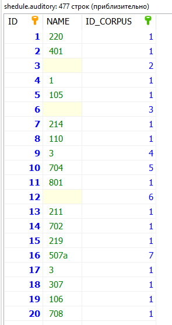
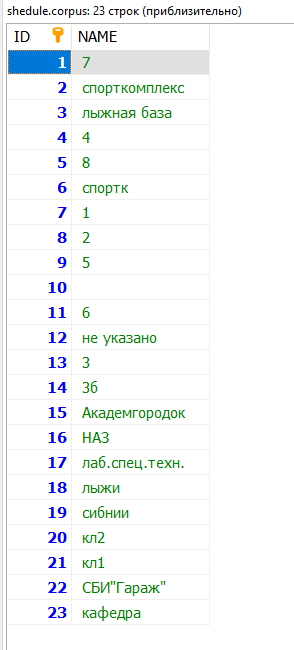
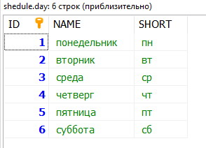
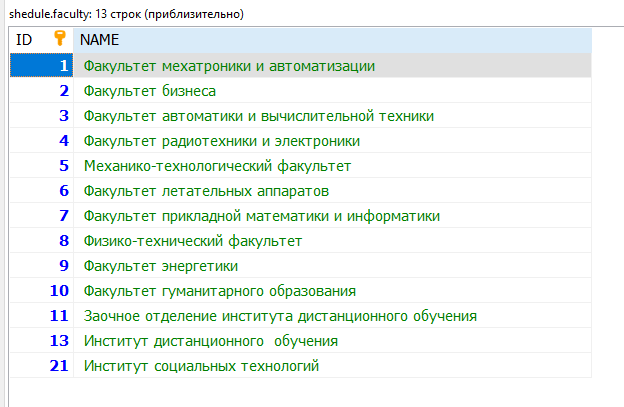
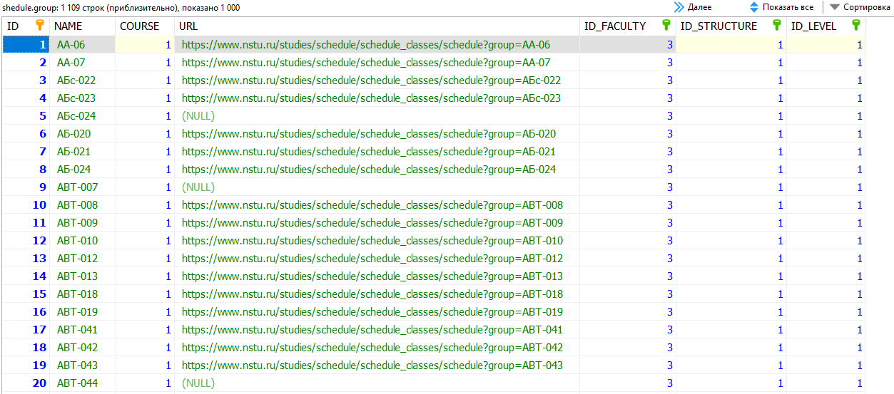
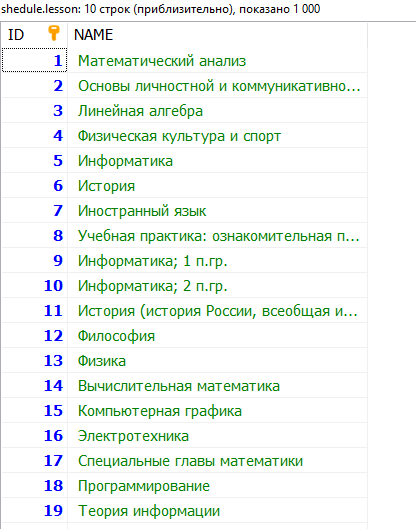
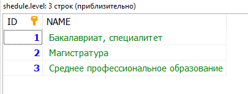
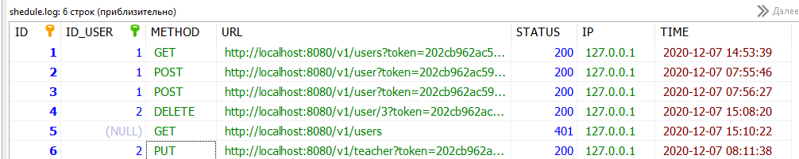

# Задача
Разработать REST API для получения расписания занятий.

# Структура базы данных

## auditory 
Кабинеты. В таблице хранится только номер кабинета. Например - **101**. Номер представлен в текстовом виде, т.к. не всегда это число. Номер корпуса указан в отдельной таблице. Поле **NAME** может быть пустой строкой, т.к. не у всех дисциплин указана аудитория.

|Название|Тип|Длина|Беззнаковое|По умолчанию|Описание|
|--------|---|-----|-----------|------------|--------|
|**ID**|INT|10|Да|AUTO_INCREMENT|уникальный идентификатор|
|**NAME**|VARCHAR|200|-|-|название кабинета|
|**ID_CORPUS**|INT|10|Да|-|идентификатор корпуса (внешний ключ на таблицу corpus)|

  
Индексы

  
>**ID** - PRIMARY KEY

>**ID_CORPUS** - FOREIGN KEY

  
Пример

  

## corpus 
Учебные корпуса. Номер представлен в текстовом виде, т.к. не всегда это число. Поле **NAME** может быть пустой строкой, т.к. не у всех дисциплин указан корпус.

|Название|Тип|Длина|Беззнаковое|По умолчанию|Описание|
|--------|---|-----|-----------|------------|--------|
|**ID**|INT|10|Да|AUTO_INCREMENT|уникальный идентификатор|
|**NAME**|VARCHAR|200|-|-|номер корпуса|

  
Индексы

  
>**ID** - PRIMARY KEY

  
Пример

  

## day 
Названия дней недели. 

|Название|Тип|Длина|Беззнаковое|По умолчанию|Описание|
|--------|---|-----|-----------|------------|--------|
|**ID**|INT|10|Да|-|уникальный идентификатор|
|**NAME**|VARCHAR|50|-|-|название дня недели|
|**SHORT**|VARCHAR|50|-|-|сокращенное название|

  
Индексы

  
>**ID** - PRIMARY KEY

  
Пример

  

## faculty 
Названия факультетов. 

|Название|Тип|Длина|Беззнаковое|По умолчанию|Описание|
|--------|---|-----|-----------|------------|--------|
|**ID**|INT|10|Да|-|уникальный идентификатор|
|**NAME**|VARCHAR|200|-|-|название факультета|

  
Индексы

  
>**ID** - PRIMARY KEY

  
Пример

  

## group 
Данные о группах. 

|Название|Тип|Длина|Беззнаковое|По умолчанию|Описание|
|--------|---|-----|-----------|------------|--------|
|**ID**|INT|10|Да|AUTO_INCREMENT|уникальный идентификатор|
|**NAME**|VARCHAR|200|-|-|название группы|
|**COURSE**|INT|10|Да|-|номер курса|
|**URL**|VARCHAR|200|-|NULL|ссылка на расписание группы на сайте НГТУ|
|**ID_FACULTY**|INT|10|Да|-|идентификатор факультета на котором обучается группа|
|**ID_STRUCTURE**|INT|10|Да|-|идентификатор отделения на котором обучается группа|
|**ID_LEVEL**|INT|10|Да|-|идентификатор уровня обучения|

  
Индексы

  
>**ID** - PRIMARY KEY

>**ID_FACULTY** - FOREIGN KEY

>**ID_STRUCTURE** - FOREIGN KEY

>**ID_LEVEL** - FOREIGN KEY

  
Пример

  

## lesson 
Названия дисциплин. 

|Название|Тип|Длина|Беззнаковое|По умолчанию|Описание|
|--------|---|-----|-----------|------------|--------|
|**ID**|INT|10|Да|AUTO_INCREMENT|уникальный идентификатор|
|**NAME**|VARCHAR|200|-|-|название дисциплины|

  
Индексы

  
>**ID** - PRIMARY KEY

  
Пример

  

## level 
Уровни обучения (бакалвриат, магистратура и т.п.). 

|Название|Тип|Длина|Беззнаковое|По умолчанию|Описание|
|--------|---|-----|-----------|------------|--------|
|**ID**|INT|10|Да|AUTO_INCREMENT|уникальный идентификатор|
|**NAME**|VARCHAR|200|-|-|название уровня|

  
Индексы

  
>**ID** - PRIMARY KEY

  
Пример

  

## log 
История запросов к API.

|Название|Тип|Длина|Беззнаковое|По умолчанию|Описание|
|--------|---|-----|-----------|------------|--------|
|**ID**|INT|10|Да|AUTO_INCREMENT|уникальный идентификатор|
|**ID_USER**|INT|10|Да|-|идентификатор пользователя, выполнившего запрос. Если пользователю было отказано в доступе - равен NULL|
|**METHOD**|VARCHAR|6|-|-|название метода|

  
Индексы

  
>**ID** - PRIMARY KEY

  
Пример

  

